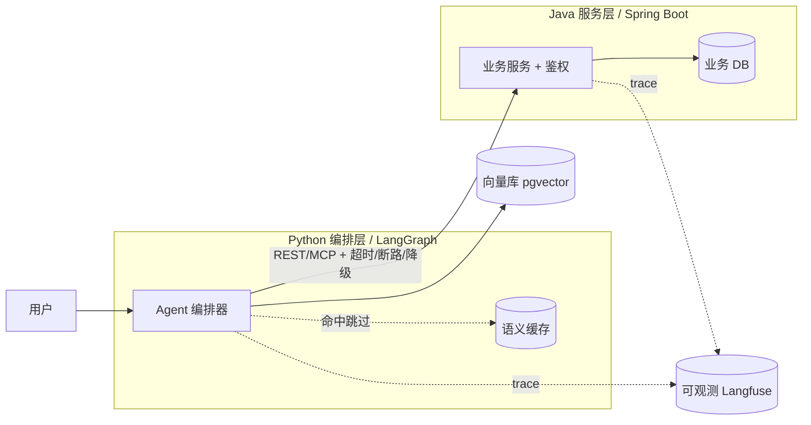

# Day 69 · 文档与表达：README + 架构图 + 把生产实力讲清楚

> **今日目标**：给三个项目写出"5 分钟看懂"的 README + 架构图，并把 eval / 可观测 / 安全这三块练成能脱口而出的面试话术。
> **时长**：~2h ｜ **前置**：Day 68（作品集骨架已收拢）
> **今日产出**：每个项目一份合格 README（含 Mermaid 架构图）+ 一页《三大生产实力讲解话术卡》（eval / 可观测 / 安全各一段，2 分钟讲完）。

## 1. 为什么 & 是什么（概念 + Java 类比）

到这一步，技术早就够了——**差距在"讲不讲得清"**。同样的混合系统，有人说"我做了个 Agent 接了 Java"，有人说"我把 LLM 的不确定性隔离在编排层、用断路器和降级保证 Java 宕机时系统不崩、trace 从 Python 一路追到 Java、eval 覆盖 N 条用例守住幻觉率"——后者直接拿 offer。今天专练表达：**README 是异步表达，架构图是结构表达，话术是同步表达**，三者都要过关。

给 Java 工程师的类比，都是你熟的"技术沟通"场景：

| 表达载体 | Java/工程世界类比 | 要点 |
|---|---|---|
| README | 项目 Wiki / 上手文档 | 让人**不问你**就能看懂、跑起来 |
| 架构图（Mermaid） | C4 / 时序图 / 部署图 | 一张图说清"组件 + 数据流 + 边界" |
| 话术卡 | 技术评审 / 述职答辩 | 把复杂系统压成 2 分钟，结论先行 |
| eval/可观测/安全三连 | 质量 + 监控 + 安全合规 | 这三块是"上线过"的硬证据，最值钱 |

**核心心智：默认读者没耐心、没上下文。** README 第一屏就要回答"这是什么 / 解决什么 / 怎么跑 / 亮点在哪"；架构图要让人 10 秒看出边界；话术要**结论先行**（先说"我做了什么、效果如何"，再展开怎么做）。

## 2. 跟着做（Hands-on）

**Step 1 — README 第一屏模板**（每个项目都按这个骨架写，顺序别变）：

```markdown
# 项目名 · 一句话定位（如：带引用溯源的企业文档问答系统）

> 解决什么问题 + 给谁用，两句话讲完。

## 架构一图流
（此处放 Mermaid 架构图）

## 30 秒跑起来
\`\`\`bash
cp .env.example .env && docker compose up --build
\`\`\`

## 亮点（差异化）
- 🔍 引用溯源：每条答案可点回原文，幻觉率 <Z>%
- 📊 可观测：全链路 trace（截图）
- 🛡️ 安全：prompt 注入防护 + 输出校验

## eval / 可观测 / 安全
- eval：测试集 N 条，准确率 X%、幻觉率 Z%（附 `eval/` 脚本）
- 可观测：Langfuse trace（附截图），可看 token/延迟/成本
- 安全：见下文「安全」小节
```

**Step 2 — 用 Mermaid 画架构图**（文本即图、随代码进版本库，比贴图片强）：



> 一张好架构图的**必备要素**（自查）：① 清晰的边界框（Python 层 vs Java 层）；② 数据流方向（箭头）；③ 关键中间件（向量库/缓存/可观测）；④ 边界上的"防护标注"（超时/断路/降级）；⑤ trace 的贯通线。缺哪补哪。

**Step 3 — 写《三大生产实力话术卡》**（每段都"结论先行 → 怎么做 → 数字收尾"，照着能 2 分钟讲完）：

```text
【可观测性 · 2 分钟】
结论：我给系统接了全链路 trace，能把一次请求拆到每一段看 token/延迟/成本。
怎么做：用 OpenTelemetry/Langfuse，trace 从 Python 编排层一路透传到 Java 服务层，
       每次 LLM 调用、每个工具、每条 SQL 都有 span。
价值：上次一个 8s 的慢请求，我看 trace 10 秒就定位到是某个慢 SQL，而不是模型慢。
数字：优化后 p95 从 _ 降到 _，单请求成本降 _%。

【eval · 2 分钟】
结论：我建了回归测试集，改一处不再担心崩别处。
怎么做：N 条标注用例，跑准确率 + 幻觉率，纳入 CI；新 prompt/新模型先过 eval 再上。
价值：把"凭感觉调 prompt"变成"用指标验证"，这是和只会写 demo 的人最大的区别。
数字：当前准确率 _%、幻觉率 _%，回归覆盖 N 条。

【安全 · 2 分钟】
结论：我按 OWASP for LLM 自查过，重点防了 prompt 注入和越权工具调用。
怎么做：输入侧做注入检测；工具层有权限边界（Agent 不能调它不该调的）；
       输出侧做校验/脱敏；写操作幂等。
价值：Agent 一旦能调工具/碰数据，安全就不是可选项。
数字：覆盖 OWASP LLM Top 10 中的 N 条，附自查清单。
```

**Step 4 — 录一遍自己讲**：对着话术卡把三段各讲一遍（可录音回放）。卡壳的地方就是你"其实没真懂"的地方，回去补。

## 3. 今日任务

1. **写三份 README**：每个项目按第一屏模板写，确保"是什么/怎么跑/亮点"前三屏可见。
2. **画三张架构图**：用 Mermaid，逐张对照"必备要素"自查（边界/数据流/中间件/防护标注/trace 线）。
3. **写话术卡**：eval / 可观测 / 安全各一段，结论先行、数字收尾，每段控制在 2 分钟。
4. **开口讲一遍**：对着话术卡把三段讲出来（最好录音），标出卡壳处并回补。

**验收标准**：①三份 README 都能让一个没上下文的人 5 分钟看懂并跑起来；②三张架构图含全部必备要素；③话术卡三段都"结论先行 + 真实数字收尾"；④你能不看稿、流畅讲完 eval/可观测/安全任意一段。

## 4. 自测清单

- [ ] 我的 README 第一屏就回答了"是什么/解决什么/怎么跑/亮点"。
- [ ] 架构图能让人 10 秒看出"Python 层 vs Java 层"的边界和数据流。
- [ ] 我能**结论先行**地讲清可观测：先说价值和数字，再展开怎么做。
- [ ] 我能讲清 eval 为什么是"和只会写 demo 的人拉开差距"的关键。
- [ ] 我能按 OWASP for LLM 说出自己防了哪几类风险，而不是泛泛说"做了安全"。

## 5. 延伸 & 关联

- 评估 + 监控（eval / 可观测话术的技术底稿）：[../08-llm-engineering/03-mlops/02-evaluation-and-monitoring.md](../08-llm-engineering/03-mlops/02-evaluation-and-monitoring.md)
- 实验追踪（trace / 指标的工具背景）：[../08-llm-engineering/03-mlops/01-experiment-tracking.md](../08-llm-engineering/03-mlops/01-experiment-tracking.md)
- API 服务（架构图里 Java 服务层的对应实现）：[../08-llm-engineering/02-model-serving/02-api-service.md](../08-llm-engineering/02-model-serving/02-api-service.md)
- 提示工程进阶（安全话术里"注入防护"的背景）：[../07-llm-applications/02-prompt-engineering/02-advanced-techniques.md](../07-llm-applications/02-prompt-engineering/02-advanced-techniques.md)
- 总计划：[../AI-Agent-每日学习计划.md](../AI-Agent-每日学习计划.md)

> 衔接 Day 70：项目能讲清了。最后一天做**总复盘**，并决定下一程深挖方向——是把 AI 接回 Java 体系（方向 A），还是走纯 AI 工程（方向 B）。
